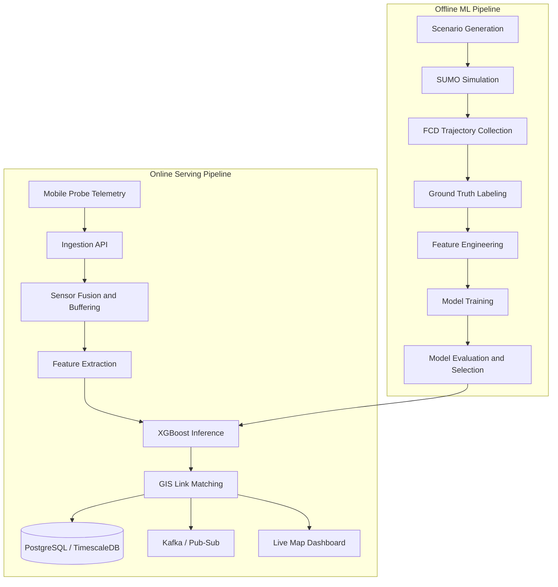
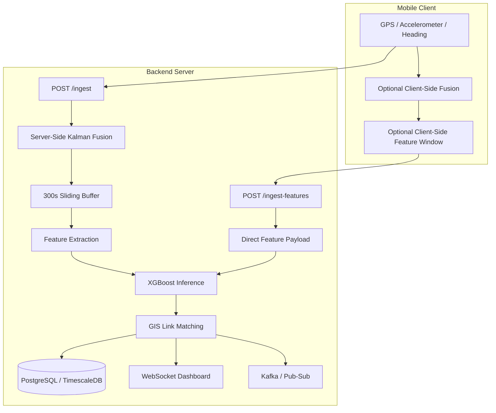
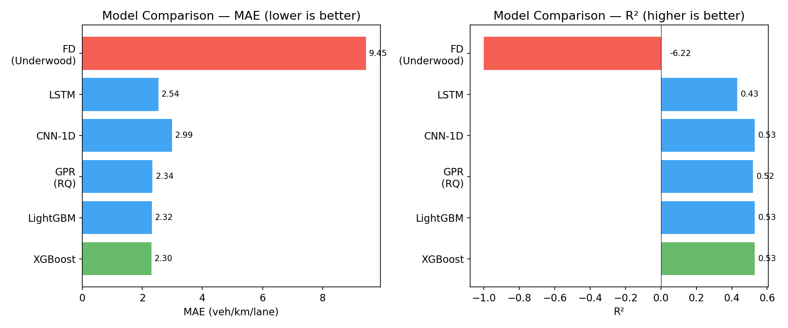
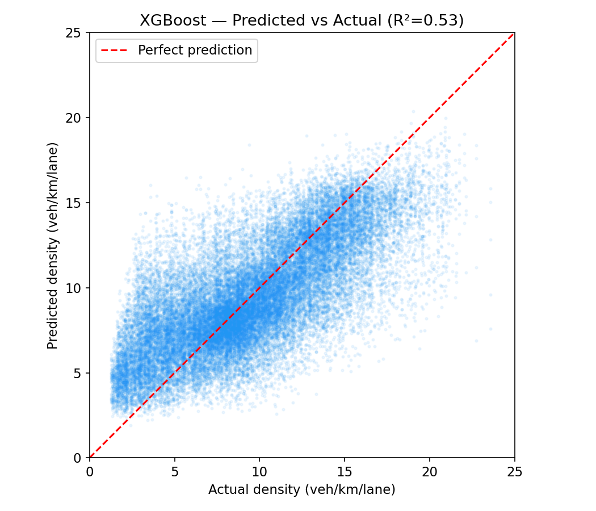
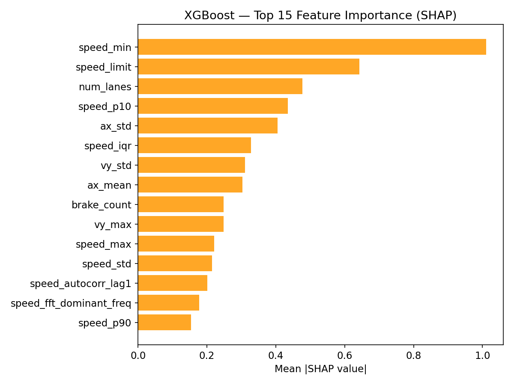
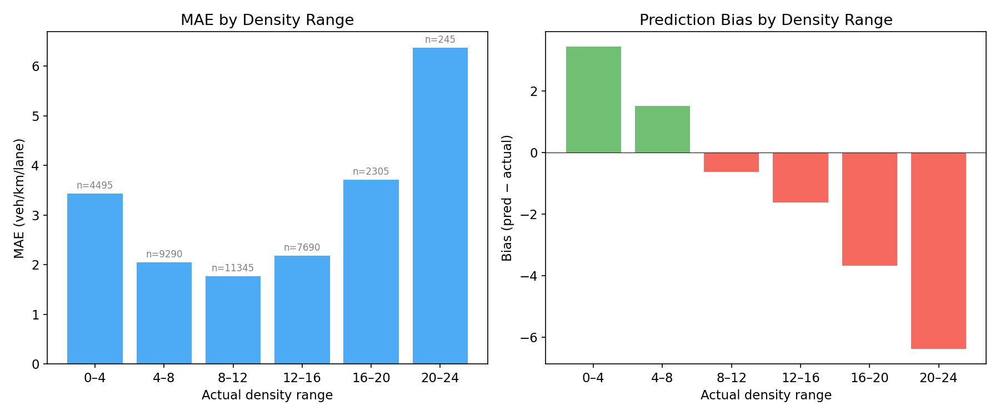

# UrbanFlow — Real-Time Traffic Density Estimation from Probe Vehicle Data

This project estimates road-level traffic density from a single probe vehicle's mobile telemetry and packages the result as a deployable data and ML system with real-time inference, spatial matching, SQL-backed storage, dashboards, and cloud deployment.

**[Live Portfolio](https://traffic-estimator-gcbqhrztha-du.a.run.app/)** · **[Console](https://traffic-estimator-gcbqhrztha-du.a.run.app/dashboard)** · **[API Docs](https://traffic-estimator-gcbqhrztha-du.a.run.app/docs)** · **[Map](https://traffic-estimator-gcbqhrztha-du.a.run.app/map)** · **[ML Pipeline](https://traffic-estimator-gcbqhrztha-du.a.run.app/ml-pipeline/)**

The repository focuses on:

- simulation-based traffic dataset generation
- feature-engineered ML model comparison and serving
- real-time mobile telemetry ingestion and spatial link matching
- async backend APIs, SQL persistence, and streaming interfaces
- portfolio-ready dashboards, containerization, CI/CD, and Cloud Run deployment

## Overview

Estimating traffic state from a single moving vehicle is noisy, information-limited, and difficult to operationalize. UrbanFlow addresses that by combining simulation-based labeling, feature-engineered ML, and deployment-oriented backend services in one system.

The end-to-end workflow is:

1. Generate traffic scenarios in SUMO and collect floating-car trajectories.
2. Build labels and engineered features grounded in traffic flow theory and car-following behavior.
3. Compare multiple model families and select the best deployment model.
4. Serve link-level predictions through FastAPI, GIS matching, SQL persistence, streaming, and dashboards.

The key design choice is treating the project as a full system rather than a notebook-only benchmark:

- Offline pipeline:
  - simulation, labeling, feature extraction, training, and evaluation
- Online serving layer:
  - mobile telemetry ingestion, Kalman fusion, feature generation, inference, and link matching
- Review and operations layer:
  - PostgreSQL-backed history, live map inspection, dashboard views, containerization, and CI/CD

Designed, implemented, and deployed as a solo end-to-end project.

## Engineering Scope

| Area | Implementation |
|------|---------------|
| **Data pipelines** | SUMO simulation → FCD collection → feature extraction → model training → evaluation, config-driven with versioned run directories |
| **Backend API** | FastAPI async app: batch inference, mobile sensor ingest, map history, WebSocket, health check |
| **Database** | Async PostgreSQL + TimescaleDB via SQLAlchemy, full ORM, transactional writes |
| **Streaming** | Kafka + GCP Pub/Sub dual-broker abstraction, 1Hz mobile ingestion, WebSocket push |
| **Cloud deployment** | Docker → GitHub Actions CI/CD → GCP Artifact Registry → Cloud Run, with Cloud SQL + Pub/Sub + Secret Manager |
| **ML workflow** | 176K samples, 32 engineered features, GroupKFold CV, SHAP analysis, 6 model families compared |
| **CI/CD** | Lint → type check → pytest matrix (3.11–3.13) → Docker build → Cloud Run deploy + verify |
| **Frontend** | Console dashboard, mobile probe collector, Leaflet.js interactive map, ML pipeline manager |

## System Architecture

UrbanFlow combines an offline workflow for simulation, feature engineering, and model development with an online serving pipeline for real-time inference, storage, and visualization.



This architecture reflects the full lifecycle of the project: generate traffic data, train and compare models, select the best deployment model, and serve link-level predictions through a real-time backend.

## Client and Server Responsibilities

The serving layer supports both a server-centric ingestion flow and a client-assisted feature submission flow, making the mobile/server processing boundary explicit.



- `POST /ingest` performs server-side fusion, buffering, feature extraction, and inference.
- `POST /ingest-features` accepts a precomputed feature window from the client and performs lightweight inference on the server.
- This split supports both richer backend processing and lower-overhead client-assisted operation.

## Data Pipeline

The pipeline starts from synthetic traffic generation in SUMO (20,000 scenarios × 5 probes = 176,845 samples), collects 6-channel floating-car trajectories (VX, VY, AX, AY, speed, brake at 1Hz × 300s), extracts features grounded in traffic flow theory, trains and evaluates multiple model families, and deploys the best model behind the serving API.

Each stage writes to a versioned run directory with manifest tracking. The ML pipeline dashboard supports resuming from any intermediate stage — retrain on existing features, re-evaluate a saved model, or filter by lane count and speed limit.

## ML Approach

### Feature Engineering

32 features engineered from traffic flow theory and car-following dynamics:
- **Speed-density relationships** — 5 fundamental diagram models (Underwood, Greenshields, Greenberg, Drake, Multi-regime)
- **Car-following proxies** — acceleration variance, jerk, speed autocorrelation
- **Congestion indicators** — stop count, brake ratio, slow-duration ratio
- **Lateral dynamics** — VY variance, lateral energy
- **Time-series properties** — FFT dominant frequency, sample entropy

Features are registered via `@register_feature` decorator and selected through YAML config without code changes.

### Model Comparison

| Model | MAE | RMSE | R² | Notes |
|-------|-----|------|-----|-------|
| Fundamental Diagram (Underwood) | 9.45 | 11.69 | -6.22 | Physics-only baseline |
| LSTM (6ch × 300) | 2.54 | 3.28 | 0.43 | Raw time-series |
| CNN-1D (6ch × 300) | 2.99 | 2.97 | 0.53 | Raw time-series |
| GPR (Rational Quadratic) | 2.34 | 3.01 | 0.52 | 141K train, 4 kernels tested |
| LightGBM (32 features) | 2.32 | 3.00 | 0.53 | Tabular features |
| **XGBoost (32 features)** | **2.30** | **2.97** | **0.53** | **Best → production model** |

XGBoost became the production model based on consistent performance across metrics. The comparison spanned GPR with 4 kernel functions, window-based temporal features, density-weighted sampling, bias correction, isotonic calibration, and k-means cluster analysis — confirming the result is stable across model families.

<p align="center">
  
</p>

<p align="center">
  
  
</p>

<p align="center">
  
</p>

### Residual Learning

Inference combines a physics baseline with ML correction:
1. Estimate baseline density from the Underwood fundamental diagram
2. Predict the residual with XGBoost
3. Final estimate = FD baseline + ML residual

This keeps the model grounded in domain knowledge and improves interpretability.

### Observational Limit

Systematic experimentation across all model families suggests **R²≈0.53 is the practical ceiling** for single-probe density estimation. At low density (0–8 veh/km/lane), the probe drives in free-flow regardless of surrounding vehicles, so its trajectory carries minimal information about traffic volume. This defines the sensing boundary and what additional data sources (gap sensors, multi-probe fusion) would be needed to push further.

## Backend and Data Engineering

### API

**FastAPI** async backend serving batch inference (`POST /predict`), live mobile ingestion (`POST /ingest`), link-level map history (`/map/links/*`), and WebSocket prediction push. Uses lifespan management and degrades gracefully when optional services (DB, Kafka, GIS) are unavailable.

### Database

Async SQLAlchemy + asyncpg with full ORM: Prediction, RoadLink, FCDRecordRow, Scenario. TimescaleDB hypertable for time-series FCD storage. Transactional writes with link upsert logic.

### Spatial Optimization

Matching GPS to 400K+ Seoul road links required spatial indexing:

| Approach | Complexity | Typical latency |
|----------|-----------|-----------------|
| Naive scan | O(n) | ~50ms |
| **Grid index** (0.001° ≈ 100m cells) | **O(1) + 3×3 neighborhood** | **<1ms** |

Links are pre-indexed into grid cells, scored by perpendicular distance + heading alignment, and **re-matched only when the probe moves >30m** — reducing GIS calls by roughly 90%.

### Streaming

A dual-broker abstraction auto-detects Kafka or GCP Pub/Sub from environment variables. The same publish interface works across local docker-compose and Cloud Run with zero code changes.

### Sensor Fusion

A **2D Kalman filter** fuses noisy GPS and accelerometer data per session:
- State: `[x, vx, y, vy]` in equirectangular frame
- GPS measurement (σ=5m) + accelerometer control input (heading-rotated)
- Sessions are garbage-collected after 10 minutes of inactivity

## Platform and DevOps

### Web Interfaces

- **ML Pipeline** (`/ml-pipeline/`) — run versioning, stage resume, model/feature selection, live log streaming
- **Console** (`/dashboard`) — project overview and service health
- **Mobile Probe** (`/mobile`) — browser-based GPS+accel collection with client-side Kalman filter
- **Map** (`/map`) — Leaflet.js with color-coded link densities and prediction history

### Docker and CI/CD

**Local**: docker-compose with PostgreSQL + TimescaleDB, Kafka, and FastAPI — all health-checked.

**CI** (every push): ruff → mypy → pytest (3.11/3.12/3.13) → Docker build smoke test.

**CD** (on GitHub Release): build & push to GHCR + GCP Artifact Registry → deploy to Cloud Run (0–2 auto-scaling) → verify health endpoints.

### Performance

- **MPS (Apple Silicon) training**: auto device detection (CUDA → MPS → CPU). CNN-1D measured at ~22× faster on MPS vs CPU on M5 MacBook Air (3.6ms vs 80ms per batch, batch_size=128)
- **Density-weighted sampling**: configurable weights to compensate for high-density data scarcity
- **Config inheritance**: YAML `_base_` with recursive merge for DRY experiment configs

## Project Structure

```
src/
├── api/            FastAPI app, ingest pipeline, map router, async DB, schemas
├── data/           Datasets, Parquet I/O, preprocessing
├── evaluation/     Metrics, SHAP, traffic state classification
├── features/       @register_feature registry, 7 modules, window features
├── gis/            Grid-indexed link matcher
├── models/         XGBoost, LightGBM, CNN1D, LSTM, FD models
├── simulation/     SUMO network gen, FCD collection, Edie ground truth
├── streaming/      Kafka/Pub-Sub abstraction, Kalman sensor fusion
├── training/       TabularTrainer (GroupKFold), DLTrainer (PyTorch), Optuna
├── utils/          Config, logging, seed, checkpoints
└── visualization/  Plots, SHAP, model comparison

scripts/            Pipeline entry points, dashboard, console
static/             Web pages (console, mobile, map, pipeline)
configs/            Hierarchical YAML (inheritable via _base_)
.github/workflows/  CI + CD
```

## Tech Stack

| Layer | Technologies |
|-------|-------------|
| **ML** | XGBoost, LightGBM, PyTorch (CNN-1D, LSTM), GPyTorch (GPR), scikit-learn, SHAP, Optuna |
| **Backend** | FastAPI, uvicorn, WebSocket, Pydantic |
| **Database** | PostgreSQL + TimescaleDB, SQLAlchemy (async), asyncpg |
| **Streaming** | Apache Kafka, Google Cloud Pub/Sub |
| **Spatial** | Custom grid-indexed matcher, GeoJSON, Leaflet.js |
| **Infra** | Docker, Cloud Run, Artifact Registry, Secret Manager, GitHub Actions |
| **Data** | Apache Parquet, NumPy NPZ, YAML configs |
| **Simulation** | SUMO (TraCI), Edie's generalized definitions |

## Quick Start

```bash
pip install -e ".[dev]"
pytest

# With Docker
docker-compose up -d && curl localhost:8000/health

# Without Docker
python scripts/run_console.py

# → /dashboard      project console
# → /map            density map
# → /mobile         probe collection
# → /ml-pipeline/   pipeline manager
# → /docs           OpenAPI docs
```

**Recommended first pages**: [`/dashboard`](https://traffic-estimator-gcbqhrztha-du.a.run.app/dashboard) for project overview, [`/map`](https://traffic-estimator-gcbqhrztha-du.a.run.app/map) for live predictions, [`/docs`](https://traffic-estimator-gcbqhrztha-du.a.run.app/docs) for API reference.

## License

MIT
