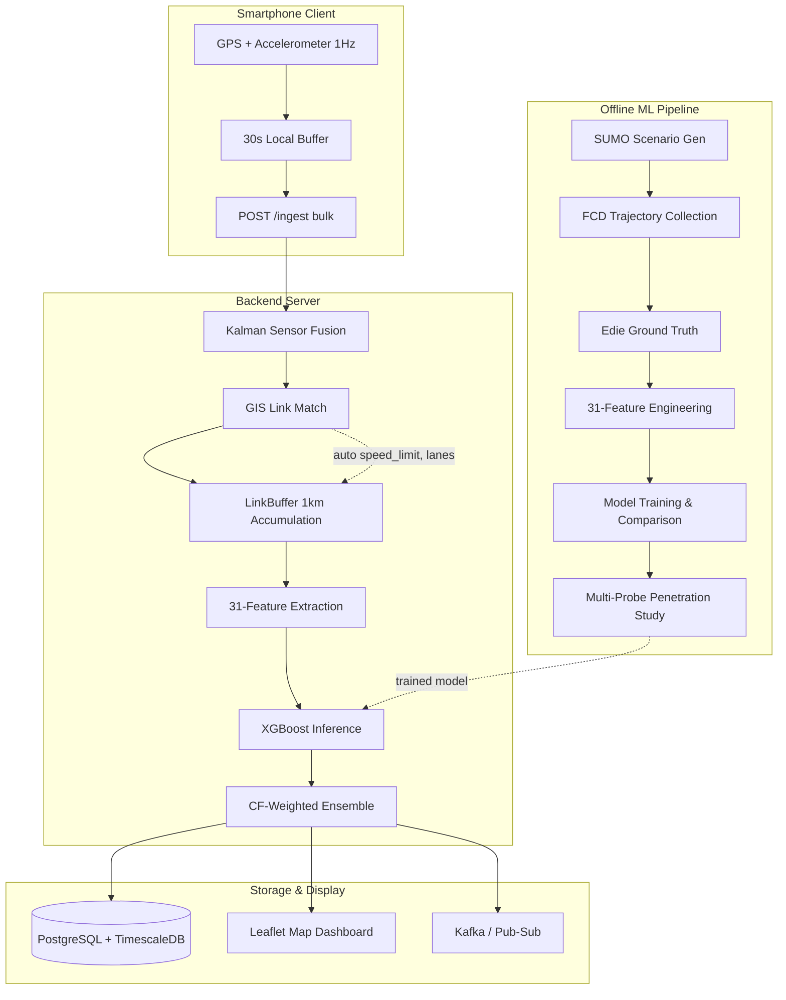
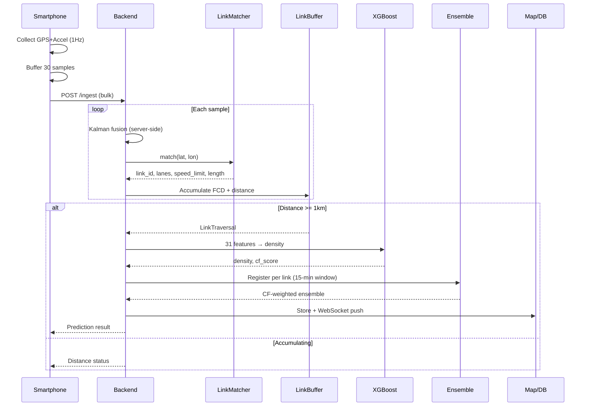
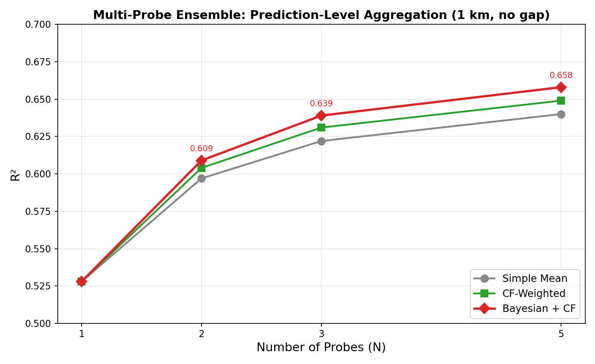
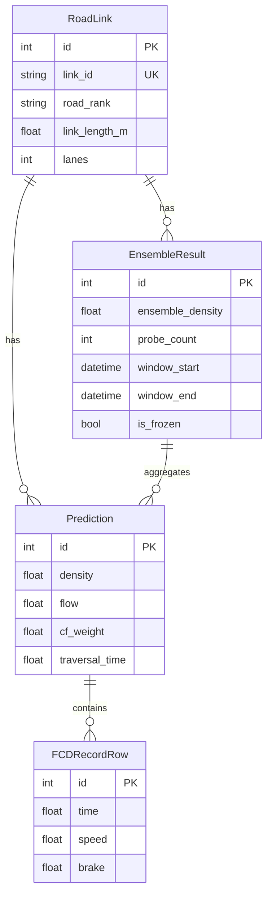

# UrbanFlow — Traffic Density Estimation from Probe Vehicles

Predict how congested a road is using only smartphone sensor data from vehicles driving on it.

UrbanFlow is an end-to-end traffic density estimation system that turns GPS + accelerometer trajectories from probe vehicles into per-link density estimates. It combines simulation-trained ML (XGBoost on 31 car-following features) with multi-probe Bayesian ensemble, and serves predictions through a real-time pipeline deployed on Seoul's arterial road network (2.2K MOCT standard links).

**[Live Demo](https://traffic-estimator-gcbqhrztha-du.a.run.app/)** · **[API Docs](https://traffic-estimator-gcbqhrztha-du.a.run.app/docs)** · **[Map](https://traffic-estimator-gcbqhrztha-du.a.run.app/map)** · **[ML Pipeline](https://traffic-estimator-gcbqhrztha-du.a.run.app/ml-pipeline/)**

<p align="center">
  
</p>

---

## Table of Contents

- [What This Project Does](#what-this-project-does)
- [Problem](#problem)
- [System Architecture](#system-architecture)
- [ML Approach](#ml-approach)
- [Backend and Data Engineering](#backend-and-data-engineering)
- [Lessons Learned](#lessons-learned)
- [Tech Stack](#tech-stack)
- [Running the Project](#running-the-project)
- [Project Structure](#project-structure)

---

## What This Project Does

1. **Generates labeled traffic data** — 35K SUMO scenarios × 5 probes = 176K samples of 6-channel trajectories (VX, VY, AX, AY, speed, brake)
2. **Engineers 31 features** from car-following theory — speed statistics, acceleration patterns, braking behavior, lateral dynamics, time-series properties
3. **Trains and compares 6 model families** — XGBoost, LightGBM, LSTM, CNN-1D, GPR, FD baselines under the same pipeline
4. **Serves link-level predictions** — FastAPI, GIS link matching (2.2K Seoul arterial links), multi-probe ensemble, PostgreSQL, Kafka/Pub-Sub, Leaflet map
5. **Multi-probe ensemble** — CF-weighted Bayesian aggregation of predictions per road link within a 15-minute rolling window

Solo end-to-end project: simulation → ML → backend → deployment.

## Problem

Traffic density — vehicles per kilometer — is the fundamental measure of road congestion. But measuring it traditionally requires **loop detectors, cameras, or radar** embedded in the road, which are expensive and cover only major corridors.

Probe vehicles (taxis, ride-hails, smartphones) are everywhere, but a single probe only observes its own trajectory. The core challenge: **can you estimate how many vehicles surround a probe, using only its speed, acceleration, and braking patterns?**

Systematic experiments across 6 model families confirmed that single-probe accuracy plateaus at R²≈0.45–0.50 regardless of algorithm. This motivated the shift to multi-probe fusion: combining 5 probes via CF-weighted Bayesian ensemble improved R² to 0.67 — a +47% gain that no single-model optimization could achieve.

---

## System Architecture



### Real-Time Inference Sequence



### Key Design Decisions

**Link-based inference (not time-based)**: The system accumulates FCD as the probe traverses consecutive road links, triggering prediction at **1km+ distance** — not after a fixed time window. Seoul arterial links average 80–120m, so the system chains ~10 consecutive links per prediction.

**Client sends raw, server does everything**: Smartphone buffers 30s of raw GPS+accel locally, sends bulk. No fusion or ML on device. Server-side Kalman filter, GIS matching (auto-detects speed limit and lanes), feature extraction, inference, and ensemble.

**Multi-probe Bayesian ensemble**: When multiple probes traverse the same link within 15 minutes, predictions are combined using CF-weighted softmax — probes in active car-following get higher weight because their trajectories carry more density information.

---

## ML Approach

### Feature Engineering

31 features from car-following theory and traffic flow dynamics, registered via `@register_feature` decorator and selected through YAML config:

| Category | Features | Rationale |
|----------|----------|-----------|
| Speed statistics | mean, std, cv, iqr, min, max, median, p10, p90 | FD relationship proxy |
| Acceleration | ax_mean, ax_std, ay_mean, ay_std, jerk_mean, jerk_std | Car-following interaction intensity |
| Braking | brake_count, brake_time_ratio, mean_brake_duration | Congestion indicator |
| Stops | stop_count, stop_time_ratio, mean_stop_duration, slow_duration_ratio | Queue detection |
| Lateral | vy_mean, vy_std, vy_min, vy_max, vy_variance, vy_energy | Lane-change proxy |
| Time-series | speed_autocorr_lag1, speed_fft_dominant_freq, sample_entropy | Flow regime classification |

### Results

**Multi-probe penetration rate** (1km, XGBoost, CF-weighted):

| N (probes) | R² | MAE (veh/km/lane) | vs baseline |
|------------|-----|-------------------|-------------|
| 1 | 0.457 | 2.57 | — |
| 2 | 0.531 | 2.20 | +16% |
| 3 | 0.604 | 2.00 | +32% |
| 5 | **0.671** | **1.80** | **+47%** |

MAE=1.80 means **1–2 vehicles per km per lane** error — approaching fixed loop-detector noise (±1–3 veh/km/lane).

**Observation length** (N=5): 250m → R²=0.615, 500m → 0.647, 750m → 0.665, 1km → 0.671.

**Ensemble methods** (N=5): simple mean 0.601, CF-weighted 0.611, **Bayesian+CF 0.622**.

**Model comparison** (single probe): FD baseline <0, GPR 0.41, LSTM/CNN-1D 0.45, **XGBoost/LightGBM 0.50** → production.

<p align="center">
  
</p>

---

## Backend and Data Engineering

### Ingestion Pipeline

```
Smartphone (1Hz GPS + accelerometer)
  → 30s local buffer (reduce network 30×)
  → POST /ingest (bulk)
  → Kalman Filter: GPS(σ=5m) + accel → state [x, vx, y, vy]
  → GIS link match: grid-indexed 2.2K MOCT links (<1ms)
       → auto-detect speed_limit, lanes from matched link
  → LinkBuffer: accumulate FCD across consecutive links
       → "sticky link" prevents GPS jitter false transitions
  → 1km distance reached → 31 feature extraction → XGBoost
  → Prediction stored to ALL traversed links
  → Fan-out (each independent, failures don't block):
       → PostgreSQL (async transactional write)
       → WebSocket push (live dashboard)
       → Kafka/Pub-Sub (downstream consumers)
  → Ensemble aggregator: CF-weighted, 15-min rolling window
```

### Optimization Decisions

| Optimization | What it does | Impact |
|-------------|-------------|--------|
| Grid spatial index | 0.001° cells, search 3×3 neighborhood only | O(2.2K) → O(9 cells), <1ms |
| Re-match skip | Don't re-query GIS until probe moves >30m | ~90% fewer GIS calls |
| 30s bulk ingest | Client buffers locally, sends batch | 30× fewer HTTP requests |
| Sticky link | Require confirmed link change before switching | Prevents GPS jitter traversals |
| Graceful degradation | DB/Kafka/GIS each optional | Prediction always available |

### Database Schema



**Ensemble lifecycle**: new probe → find/create active ensemble for that link → CF-weighted update → extend window. No new probe within 15 min → freeze. Garbage-collected after 1 hour.

### CF-Weighted Ensemble

```math
\text{cf}_i = \sigma_{a_x} + r_{\text{brake}} + \text{CV}_{\text{speed}}
```

```math
w_i = \frac{\exp(\text{cf}_i)}{\sum_j \exp(\text{cf}_j)} \quad \text{(softmax)}
```

```math
\hat{k}_{\text{ensemble}} = \sum_i w_i \cdot \hat{k}_i
```

Car-following intensity determines how much to trust each probe. Probes in active car-following carry more density information → higher weight. Bayesian variant uses CF-informed observation uncertainty for sequential updating (R²=0.622 vs simple mean 0.601).

### Sensor Fusion

2D Kalman filter per session: state `[x, vx, y, vy]` in equirectangular frame. GPS measurement update (σ=5m) + accelerometer control input (heading-rotated). Sessions garbage-collected after 10 min inactivity.

---

## Lessons Learned

- **Domain-engineered features outperform deep learning on tabular traffic data.** XGBoost with 31 hand-crafted features (R²=0.50) consistently beat LSTM and CNN-1D on raw 6-channel timeseries (R²=0.45). Feature design grounded in car-following theory mattered more than model complexity.
- **Single-probe density estimation has a structural ceiling around R²≈0.50.** Tested across XGBoost, LightGBM, LSTM, CNN-1D, GPR (4 kernels), window features, and density weighting — all converged to the same limit. The FD free-flow branch is degenerate: speed carries no density signal when all vehicles travel at free-flow speed.
- **Multi-probe feature-level ensemble breaks the ceiling, but route alignment is required.** N=5 probes on the same segment: R²=0.67 (feature ensemble) vs R²=0.62 (prediction ensemble). In production, probes take different routes, making feature ensemble impractical. The Bayesian prediction ensemble recovers 93% of the theoretical gain without route constraints.
- **Observation distance matters more than observation time.** Switching from fixed 300-second windows to distance-based 1 km link traversals improved feature quality and aligned the system with real road network geometry (MOCT standard node-link). Seoul arterial links average 189 m, requiring LinkBuffer accumulation across multiple links.
- **Simulation produces almost no congestion without bottlenecks.** Only 48 of 176K samples showed v_ratio < 0.4. The single straight-link SUMO setup cannot generate realistic stop-and-go waves. Future work requires multi-link networks with lane drops, signals, and merge sections.

---

## Tech Stack

| Layer | Technologies |
|-------|-------------|
| **ML** | XGBoost, LightGBM, PyTorch (CNN-1D, LSTM, DeepSets), GPyTorch, scikit-learn, SHAP |
| **Backend** | FastAPI, uvicorn, WebSocket, Pydantic, SQLAlchemy async |
| **Database** | PostgreSQL + TimescaleDB, asyncpg |
| **Streaming** | Apache Kafka, Google Cloud Pub/Sub |
| **Spatial** | MOCT standard links, grid-indexed matcher, GeoJSON, Leaflet.js |
| **Infra** | Docker, Cloud Run, Artifact Registry, Secret Manager, GitHub Actions |
| **Data** | Apache Parquet, NumPy NPZ, SUMO (TraCI), Edie's definitions |

> **Note:** The [live demo](https://traffic-estimator-gcbqhrztha-du.a.run.app/) runs in read-only mode — ML Pipeline execution is disabled on the hosted server. Clone and run locally to train models.

## Running the Project

### Local (recommended for development)

```bash
python -m venv .venv
source .venv/bin/activate
pip install -e ".[dev]"
python scripts/run_console.py
```

Then open:
- `http://localhost:8000/` — project overview
- `http://localhost:8000/map` — link density map
- `http://localhost:8000/mobile` — mobile probe collection
- `http://localhost:8000/ml-pipeline/` — ML training dashboard
- `http://localhost:8000/docs` — API schema

### Docker

```bash
docker-compose up -d
curl localhost:8000/health
```

### ML Pipeline (simulation → training → evaluation)

```bash
# Full pipeline
python scripts/run_all.py --config configs/default.yaml

# Or step by step
python scripts/generate_scenarios.py --config configs/simulation/scenarios.yaml
python scripts/run_simulation.py --config configs/simulation/scenarios.yaml  # requires SUMO
python scripts/extract_features.py --config configs/default.yaml
python scripts/train.py --config configs/default.yaml
python scripts/evaluate.py --config configs/default.yaml
```

The ML Pipeline dashboard (`/ml-pipeline/`) provides a web UI for these steps with run versioning and resume support. On the hosted server, pipeline execution is disabled — clone and run locally.

### Environment Variables

| Variable | Required | Description |
|----------|----------|-------------|
| `DATABASE_URL` | No | PostgreSQL async URL. Server runs without DB if unset |
| `CONFIG_PATH` | No | Model and GIS config path (default: `configs/default.yaml`) |
| `MIN_TRAVERSAL_DISTANCE_M` | No | Min link accumulation before prediction (default: 1000) |
| `KAFKA_BOOTSTRAP_SERVERS` | No | Kafka broker. Falls back to Pub/Sub or skips |

### CI/CD and Deployment

Pushes to `main` trigger CI:
1. **Lint** — `ruff check + format`
2. **Type check** — `mypy src/api/`
3. **Test** — `pytest` (145 tests × Python 3.11–3.13)

GitHub Release triggers CD:
1. **Build** — Docker image → GCP Artifact Registry
2. **Deploy** — Cloud Run (0–2 auto-scaling, 2 GiB memory)
3. **Verify** — health check on deployed URL

## Project Structure

```
src/
├── api/            FastAPI app, link-based ingest, ensemble, async DB
├── data/           Dataset loading, Parquet I/O, preprocessing
├── evaluation/     Metrics, SHAP, traffic state classification
├── features/       @register_feature registry, 7 feature modules
├── gis/            Grid-indexed MOCT link matcher (road hierarchy)
├── models/         XGBoost, LightGBM, CNN1D, LSTM, FD, multi-probe DeepSets
├── simulation/     SUMO network gen, FCD collection, Edie ground truth
├── streaming/      Kafka/Pub-Sub abstraction, Kalman sensor fusion
├── training/       TabularTrainer (GroupKFold), DLTrainer (PyTorch)
├── utils/          Config, logging, seed, checkpoints
└── visualization/  Plots, SHAP, model comparison

scripts/            Pipeline entry points (train, evaluate, extract, dashboard)
static/             Web pages (console, mobile, map, pipeline manager)
configs/            Hierarchical YAML (inheritable via _base_)
data/gis/           MOCT standard link GeoJSON (2.2K Seoul arterial links)
.github/workflows/  CI (lint+test+build) + CD (Cloud Run deploy)
```

## License

MIT
