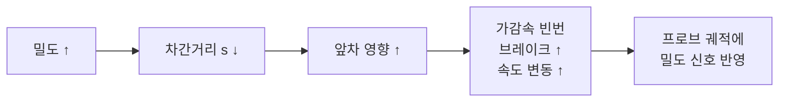
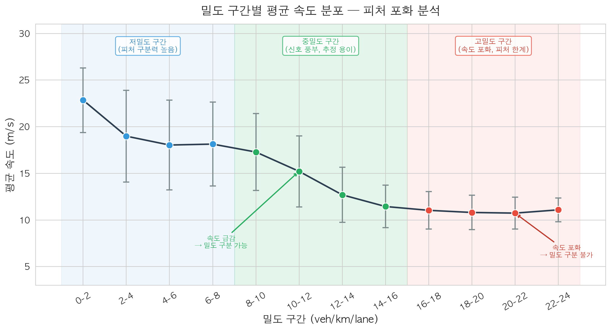
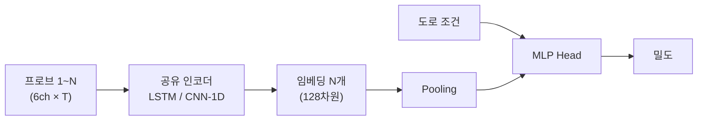
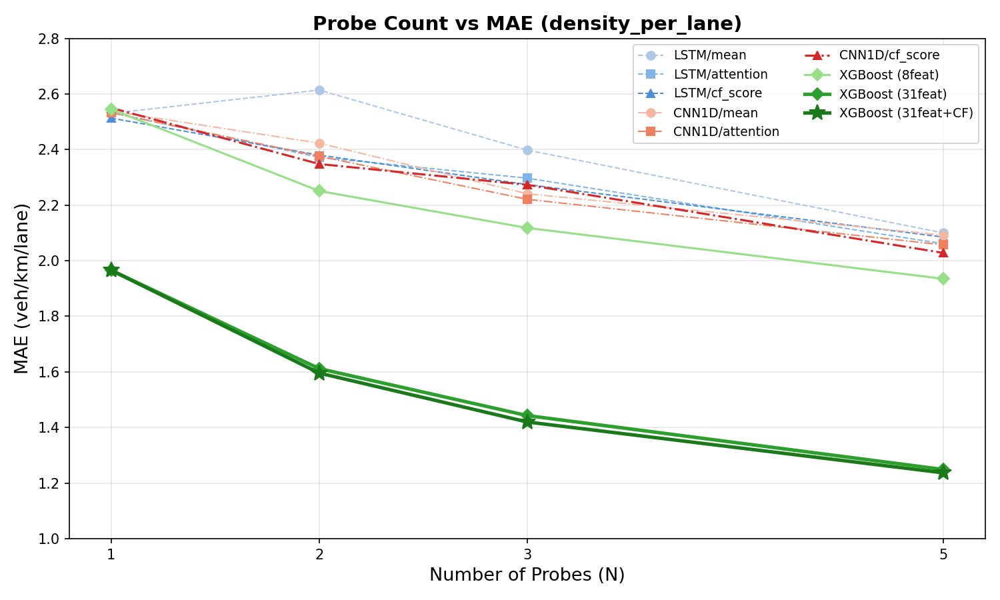
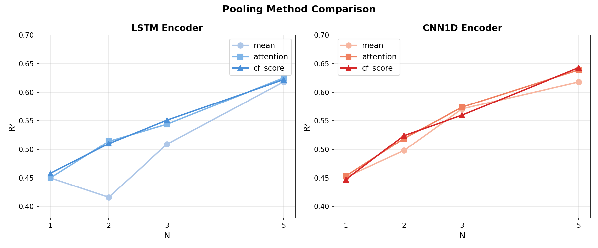
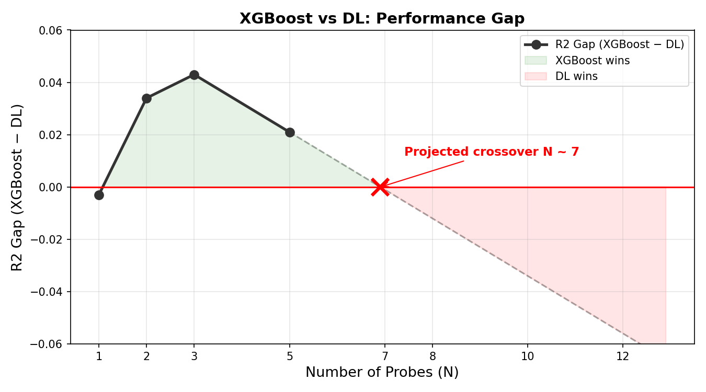

<script src="https://cdn.jsdelivr.net/npm/mathjax@3/es5/tex-mml-chtml.js"></script>
<style>
@media print {
  body { margin: 2cm; font-size: 11pt; }
  h1 { font-size: 18pt; }
  h2 { font-size: 15pt; }
  h3 { font-size: 13pt; }
  table { font-size: 10pt; }
  img { max-width: 90%; }
  pre { font-size: 9pt; }
}
</style>

# Multi-Probe Penetration Rate Study

## 프로브 차량 침투율에 따른 교통 밀도 추정 성능 분석

## 1. Car-Following으로 밀도를 왜 측정할 수 있는가

### 1.1 기본 원리

Car-following 이론(IDM, Gipps, Newell 등)에 의하면 차량의 가감속은 앞차와의 간격과 상대속도에 의해 결정된다:

$$a(t) = f\bigl(v(t),\; \Delta v(t),\; s(t)\bigr)$$

- $v$ : 자차 속도
- $\Delta v$ : 상대속도 (앞차 − 자차)
- $s$ : 차간거리 (spacing)

이 함수에 $s$ 가 포함되어 있으므로, 차량의 가감속 패턴에는 차간거리 — 즉 밀도 — 의 영향이 반영된다. 도로의 밀도가 높아지면:



반대로 밀도가 낮으면 차간거리가 충분하여 앞차 영향이 없고, 차량은 자유주행 상태로 일정한 속도를 유지한다. 이처럼 **밀도에 따라 주행 거동이 달라지므로**, 프로브 궤적을 관측하면 밀도를 간접 추정할 수 있다.

아래 그림은 밀도에 따른 도로 상황과 개별 차량의 상태를 보여준다:

```
저밀도 (k=5):
  🚗          🚗              🚗          🚗
  free        free             free        free
  ├─ 차간거리 ~200m ─┤
  → 앞차 영향 없음. 모든 차량 자유주행. v ≈ v₀

중밀도 (k=12):
  🚗   🚗  🚗     🚗 🚗    🚗     🚗  🚗
  free  fol  fol    free fol   free    fol  fol
  ├─ ~80m ─┤
  → 일부 차량이 앞차를 추종. 자유주행/추종 혼재. 가감속 발생.

고밀도 (k=20):
  🚗🚗🚗🚗🚗🚗🚗🚗🚗🚗🚗🚗
  fol fol fol fol fol fol fol fol fol fol fol fol
  ├ ~50m ┤
  → 거의 모든 차량이 추종 상태. 지속적 가감속. 저속 주행.
```

### 1.2 ML을 사용하는 이유

프로브는 차간거리 $s$ 나 주변 차량 수를 직접 관측하지 않는다. 관측 가능한 것은 자차의 **속도·가속도·브레이크** 뿐이다. 이 궤적 → 밀도 매핑은:

- **간접적**: 같은 가감속이 서로 다른 교통 상황에서 발생 가능
- **비선형**: 밀도와 거동의 관계가 구간별로 다름 (§1.3)
- **노이즈**: 운전자 이질성, 비평형 상태

이러한 **다변량 비선형 역문제**를 풀기 위해 ML을 사용한다. ML은 다채널 거동을 동시에 고려하여, 단일 변수(평균 속도) 기반 FD 역산보다 정밀한 밀도 추정이 가능하다.

### 1.3 밀도 구간별 추정 난이도

모든 밀도에서 동일하게 잘 되지는 않는다. 피처의 **신호 대 잡음비(SNR)** 가 구간별로 크게 다르다.



| 밀도 구간 | CF 상태 | 추정 난이도 | 원인 |
|-----------|---------|------------|------|
| **저밀도** (0–8) | 추종 거의 없음 | 어려움 (구조적) | $v \approx v_{free}$ 로 균일. 밀도 신호 부재 |
| **중밀도** (8–16) | 추종 혼재 | 양호 | 피처 변별력 존재 (speed Δ2–4 km/h per 구간) |
| **고밀도** (16–24) | 전부 추종 | 어려움 (피처 포화) | $v \approx 11 \pm 2$ 로 밀도 내 변별력 소멸. 신호(Δ0.3) 대비 노이즈(±2.0) 과대 |

---

## 2. 다중 프로브: 왜 좋아지는가

### 2.1 단일 프로브의 관측 한계

밀도는 본질적으로 **공간적 양**(vehicles/km)이다. 단일 프로브는 자기 궤적이라는 **시간적 정보**만 관측한다.

시간 → 공간 변환에는 **에르고딕 가정**(정상·균일 교통류에서 시간 평균 = 공간 평균)이 필요하지만, 실제 교통류는 이를 만족하지 않는다. 1대는 자기 상태(자유주행 or 추종) 하나만 관측하므로, 도로 전체의 교통 상태 분포를 알 수 없다.

### 2.2 밀도와 추종 비율의 관계

§1.1의 CF 이론에서 보았듯이, 밀도가 높아지면 차간거리가 줄어들어 추종 상태에 진입하는 차량이 많아진다. 이 관계를 정량적으로 표현하면:

| 밀도 (veh/km/lane) | 평균 차간거리 | 추종 차량 비율 | 도로 상태 |
|------------------:|------------:|------------:|----------|
| 5 | ~200 m | ~20% | 대부분 자유주행 |
| 8 | ~125 m | ~40% | 자유주행/추종 혼재 시작 |
| 12 | ~83 m | ~65% | 추종 위주, 간헐적 자유주행 |
| 15 | ~67 m | ~85% | 대부분 추종 |
| 20 | ~50 m | ~95% | 거의 전부 추종 |

밀도가 5에서 15로 3배 증가하면, 추종 비율은 20%에서 85%로 변한다. **추종 비율 자체가 밀도의 강한 지표**이다.

### 2.3 다중 프로브 = 추종 비율 샘플링

단일 프로브는 자기 상태 **1개**만 관측한다. 이것이 "자유주행"이면 도로 전체가 한산한지(k=3) 아니면 운이 좋아서 빈 공간에 있는 건지(k=10) 알 수 없다.

N대의 프로브가 있으면 **N개의 독립 샘플**을 얻어 추종 비율을 직접 추정할 수 있다:

```
k=5 (추종 비율 ~20%):
  프로브 5대 관측: free, free, free, free, fol  → 추종 1/5 = 20%  ✓

k=12 (추종 비율 ~65%):
  프로브 5대 관측: fol, free, fol, fol, fol    → 추종 4/5 = 80%  (오차 있지만 방향 맞음)

k=15 (추종 비율 ~85%):
  프로브 5대 관측: fol, fol, fol, fol, fol     → 추종 5/5 = 100% (오차 있지만 방향 맞음)
```

프로브가 많을수록 추종 비율 추정이 정확해진다. 단, 추정 오차는 $\propto 1/\sqrt{N}$ 으로 감소하므로, N이 커질수록 개선 속도가 둔화되어 자연스럽게 **포화**한다.

### 2.4 이론적 근거

| 개념 | 설명 | 본 연구와의 연결 |
|------|------|----------------|
| Edie (1963) | q, k를 시공간 영역으로 정의 | N대 = 더 큰 시공간 샘플링 |
| Wardrop (1952) | $v_s = v_t - \sigma^2 / v_t$ | N대로 공간 속도 분산 직접 측정 |
| 에르고딕 가정 | 시간평균 = 공간평균 (정상·균일 조건) | N대면 이 가정 불필요 |
| 중심극한정리 | 표본 평균 오차 $\propto 1/\sqrt{N}$ | 추종 비율 추정 정밀도 개선 |

---

## 3. 구현

### 3.1 아키텍처



각 프로브의 6채널 × 100 타임스텝 시계열을 **동일한 인코더(가중치 공유)** 로 128차원 벡터로 압축한 뒤, Pooling으로 N개를 결합하여 밀도를 예측한다. 인코더는 시계열을 한 스텝씩 순서대로 읽으며 내부 상태를 갱신하고, 마지막 상태가 해당 프로브의 주행 패턴 요약(임베딩)이 된다. 가중치 공유는 모든 프로브를 동일한 분석기로 처리한다는 의미이다.

### 3.2 Pooling 방법

#### (a) Mean Pooling

$$\mathbf{h} = \frac{1}{N} \sum_{i=1}^{N} \mathbf{e}_i$$

모든 프로브 임베딩을 동등 가중 평균.

#### (b) Attention Pooling

각 프로브의 임베딩에 대해 **"이 프로브가 밀도 추정에 얼마나 유용한가"** 를 학습된 신경망이 자동으로 평가한다.

$$\alpha_i = \text{softmax}\bigl(g(\mathbf{e}_i)\bigr), \qquad \mathbf{h} = \sum_{i=1}^{N} \alpha_i \, \mathbf{e}_i$$

학습 방법: 가중치 $\alpha_i$ 는 별도로 지정하지 않는다. 밀도 예측의 전체 손실(MSE)을 최소화하는 방향으로 역전파(backpropagation)를 통해 자동으로 학습된다. 즉, 밀도 추정에 유용한 패턴을 가진 프로브에 자연스럽게 높은 가중치가 부여된다.

#### (c) CF-Score Weighted Pooling

Attention과 달리 **교통공학적 사전 지식**으로 가중치를 산출한다. 각 프로브의 원시 시계열에서 car-following 강도를 계산:

| CF 지표 | 수식 | 의미 |
|---------|------|------|
| 가속도 변동 | $\sigma(a_{x,i})$ | 가감속이 잦을수록 추종 중 |
| 브레이크 비율 | $r_{\text{brake},i}$ | 브레이크가 잦을수록 추종 중 |
| 속도 변동계수 | $\text{CV}(v_i) = \sigma(v_i) / \bar{v}_i$ | 속도가 불안정할수록 추종 중 |

이 3개 지표를 결합하여 softmax 가중치를 산출:

$$w_i = \text{softmax}\bigl(\mathbf{a}^\top [\sigma(a_{x,i}),\; r_{\text{brake},i},\; \text{CV}(v_i)] \,/\, \tau\bigr)$$

$$\mathbf{h} = \sum_{i=1}^{N} w_i \, \mathbf{e}_i$$

**의미**: 추종 중인 프로브(가감속 크고, 브레이크 많고, 속도 불안정)에 높은 가중치를 부여. 자유주행 프로브(밀도 정보 부족)는 낮은 가중치.

### 3.3 XGBoost 비교 (Tabular)

DL과의 비교를 위해 N대 프로브의 엔지니어링 피처를 집계:

$$\bar{f}_k = \frac{1}{N}\sum_{i=1}^{N} f_{k,i}, \qquad s_k = \text{std}(\{f_{k,i}\}_{i=1}^N)$$

피처별 평균 $\bar{f}_k$ 과 표준편차 $s_k$ 를 XGBoost 입력으로 사용. 프로브 간 $s_k$ 는 **공간적 변동**을 포착한다.

---

## 4. 결과

### 4.1 프로브 수에 따른 R²


| 모델 | N=1 | N=2 | N=3 | N=5 |
|------|-----|-----|-----|-----|
| LSTM / mean | 0.450 | 0.416 | 0.509 | 0.618 |
| LSTM / attention | 0.450 | 0.514 | 0.544 | 0.625 |
| LSTM / cf_score | 0.458 | 0.510 | 0.551 | 0.622 |
| CNN1D / mean | 0.451 | 0.498 | 0.571 | 0.618 |
| CNN1D / attention | 0.453 | 0.519 | 0.574 | 0.639 |
| CNN1D / cf_score | 0.447 | 0.524 | 0.560 | 0.643 |
| **XGBoost (8피처)** | 0.444 | 0.558 | 0.603 | 0.664 |
| **XGBoost (31피처)** | **0.641** | **0.747** | **0.796** | **0.845** |
| **XGBoost (31피처+CF가중)** | 0.641 | **0.752** | **0.801** | **0.848** |

### 4.2 프로브 수에 따른 MAE



| 모델 | N=1 | N=2 | N=3 | N=5 |
|------|-----|-----|-----|-----|
| LSTM / mean | 2.530 | 2.614 | 2.398 | 2.100 |
| LSTM / attention | 2.533 | 2.372 | 2.297 | 2.061 |
| LSTM / cf_score | 2.513 | 2.380 | 2.274 | 2.085 |
| CNN1D / mean | 2.538 | 2.423 | 2.241 | 2.092 |
| CNN1D / attention | 2.533 | 2.376 | 2.221 | 2.057 |
| CNN1D / cf_score | 2.550 | 2.348 | 2.273 | 2.028 |
| **XGBoost (8피처)** | 2.545 | 2.251 | 2.118 | 1.935 |
| **XGBoost (31피처)** | **1.966** | **1.612** | **1.443** | **1.249** |
| **XGBoost (31피처+CF가중)** | 1.966 | **1.596** | **1.420** | **1.237** |

### 4.3 풀링 방법 비교



---

## 5. 분석

### 5.1 프로브 수 효과

모든 모델에서 프로브 수 증가에 따른 성능 개선이 관찰된다.

- **XGBoost**: R² 0.444 → 0.664 (+0.22), MAE 2.55 → 1.94 (**−24 %**)
- **CNN1D / cf_score**: R² 0.447 → 0.643 (+0.20), MAE 2.55 → 2.03 (**−20 %**)

N=3 → N=5 개선폭이 N=1 → N=2보다 작아지며, 이론적 $1/\sqrt{N}$ 포화 패턴과 일치한다.

### 5.2 CF-Score 가중치의 효과

CF-score 가중 풀링은 단순 평균(mean) 대비 개선을 보인다:

| N | CNN1D / mean | CNN1D / cf_score | 개선 |
|---|-------------|-----------------|------|
| 2 | 0.498 | 0.524 | **+0.026** |
| 3 | 0.571 | 0.560 | −0.011 |
| 5 | 0.618 | 0.643 | **+0.025** |

프로브가 여러 대일 때 자유주행/추종 프로브가 혼재하게 되며, **추종 중인 프로브(밀도 정보 풍부)에 높은 가중치를 부여하는 것이 유효**하다. N이 커질수록 이 혼재가 심해지므로 CF-score 가중치의 효과도 커질 것으로 예상된다.

### 5.3 DL vs XGBoost: 격차 축소와 역전 가능성



| N | CNN1D / cf_score | XGBoost | 격차 |
|---|-----------------|---------|------|
| 1 | **0.447** | 0.444 | DL +0.003 |
| 2 | 0.524 | **0.558** | XGB +0.034 |
| 3 | 0.560 | **0.603** | XGB +0.043 |
| 5 | 0.643 | **0.664** | XGB +0.021 ← **격차 축소** |

현재 N=2~5에서는 XGBoost가 우세하다. XGBoost는 프로브 간 피처를 mean/std 2개 값으로 집계하는데, 소수 프로브에서는 이것이 효율적이기 때문이다.

그러나 **N=5에서 격차가 0.021로 급감**하고 있다. 이유:

- XGBoost: N대를 mean/std **2개**로 압축 → N이 커질수록 **정보 손실 증가**
- CNN1D/cf_score: N대 각각을 **128차원 임베딩**으로 유지 → N이 커져도 정보 보존

N > 5에서는 CNN1D/cf_score가 XGBoost를 **역전할 가능성이 높다**. 이를 검증하기 위해 시나리오당 프로브 10–20대를 추출하는 추가 실험이 필요하다.

---

## 6. 한계 및 향후 연구

1. **침투율 확장** — N > 5에서 DL/XGBoost 교차점 확인 (시뮬레이션 재실행, 프로브 10–20대)
