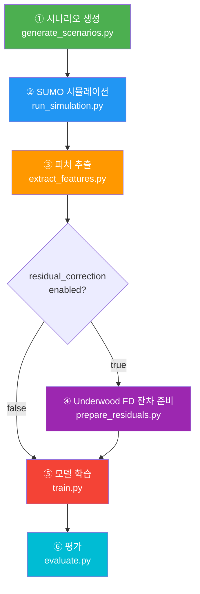
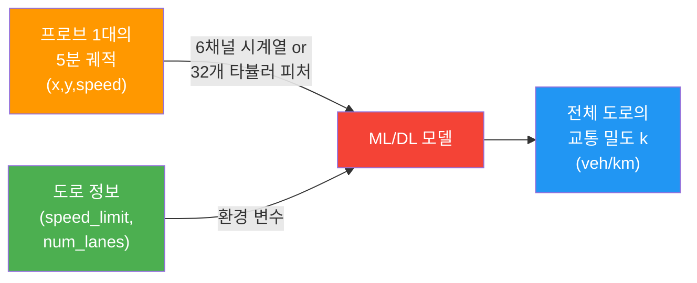

# 🚗 Traffic Density Estimation — Full Pipeline Walkthrough

> **목표**: SUMO 시뮬레이터로 생성한 교통 데이터에서, **단일 프로브 차량 1대의 5분 주행 궤적**만으로 **도로 전체(전 차선 합산)의 교통 밀도 k (veh/km)**를 추정하는 ML/DL 모델을 학습한다.

---

## 전체 파이프라인 흐름



---

## ① 시나리오 생성

> [generate_scenarios.py](file:///c:/Users/박세원/ml-project/scripts/generate_scenarios.py) → [scenario_generator.py](file:///c:/Users/박세원/ml-project/src/simulation/scenario_generator.py)

20,000개의 시뮬레이션 시나리오를 확률적으로 샘플링한다. 각 시나리오는 고유한 도로·수요·차량 파라미터 조합이다.

### 변수 결정 방식

| 변수 | 샘플링 방식 | 범위 | 단위 |
|---|---|---|---|
| `num_lanes` | `U{1, 2, 3}` (이산 균등) | 1~3 | 차선 |
| `speed_limit_kmh` | `choice([50, 60, 80, 100])` | 4종 | km/h |
| `speed_limit` | `speed_limit_kmh / 3.6` | 13.89~27.78 | m/s |
| `link_length` | `speed_limit × 600 × 1.2` | 10,000~20,000 | m |
| `per_lane_demand` | `U{800, 2200}` (이산 균등) | 800~2,200 | veh/hr/lane |
| `demand_vehph` | `per_lane_demand × num_lanes` | 800~6,600 | veh/hr |
| `truck_ratio` | [clip(N(0.16, 0.05), 0, 0.4)](file:///c:/Users/%EB%B0%95%EC%84%B8%EC%9B%90/ml-project/src/simulation/scenario_generator.py#12-21) | 0~40% | 비율 |

**차량 파라미터** (승용차/트럭 각각):

| 파라미터 | 의미 | 승용차 분포 | 트럭 분포 |
|---|---|---|---|
| `tau` | 반응 시간 | N(1.45, 1.07), [0.2, 4.0] | 동일 |
| [decel](file:///c:/Users/%EB%B0%95%EC%84%B8%EC%9B%90/ml-project/src/features/acceleration.py#36-42) | 최대 감속도 | N(4.5, 1.0), [1.0, 7.0] | N(3.0, 0.8), [1.0, 5.0] |
| `minGap` | 최소 차간 거리 | N(2.5, 0.8), [0.5, 6.0] | N(3.5, 1.0), [1.0, 8.0] |
| `speedFactor` | 제한속도 대비 실제 속도 비율 | N(1.0, 0.1), [0.2, 2.0] | N(0.85, 0.08), [0.2, 1.5] |
| `sigma` | SUMO 주행 불안정성 계수 | N(0.5, 0.15), [0, 1] | N(0.4, 0.1), [0, 1] |
| [accel](file:///c:/Users/%EB%B0%95%EC%84%B8%EC%9B%90/ml-project/src/features/acceleration.py#28-34) | 최대 가속도 | N(2.6, 0.6), [1.0, 4.0] | N(1.3, 0.4), [0.5, 2.5] |
| `length` | 차량 길이 | **4.5 (고정)** | **12.0 (고정)** |

### 핵심 설계 포인트

1. **동적 도로 길이**: `link_length = v_f × 600초 × 1.2` → 제한속도로 600초 달려도 도로 끝에 닿지 못함 → 모든 차가 600초 동안 도로 위에 생존 → **패딩 0%**
2. **차선 비례 교통량**: `demand = per_lane × lanes` → 1차선 도로에 6,000대가 몰리는 비현실적 상황 방지

### 출력
- [data/scenarios.csv](file:///c:/Users/%EB%B0%95%EC%84%B8%EC%9B%90/ml-project/data/scenarios.csv) — 20,000행 × 18+열 (시나리오 파라미터 전체)

---

## ② SUMO 시뮬레이션

> [run_simulation.py](file:///c:/Users/박세원/ml-project/scripts/run_simulation.py)

각 시나리오에서 scenarios.csv를 읽어, **단방향 직선 도로 네트워크**를 생성하고 SUMO를 600초 구동한다.

### 시간 구조

```
   0초 ─────────── 200초 ────────── 300초 ────────── 600초
    │   warmup       │  프로브 선택    │   궤적 수집     │
    │   (미기록)     │  (200~300)      │  (300~600)      │
    │                │                 │  = seq_len 300  │
    │   FCD 미수집    ├─── FCD 수집 시작 (200~600) ──────┤
```

- **0~200초**: 도로에 차량이 채워지는 워밍업 구간. FCD **미기록**
- **200~600초**: SUMO가 1초 간격으로 모든 차량의 [(time, vehicle_id, x, y, speed, lane)](file:///c:/Users/%EB%B0%95%EC%84%B8%EC%9B%90/ml-project/src/models/lstm.py#69-78) 를 [fcd.csv](file:///c:/Users/%EB%B0%95%EC%84%B8%EC%9B%90/ml-project/data/fcd_test/scenario_5/fcd.csv)에 기록

### 도로 네트워크 파라미터
- **도로 유형**: 단방향 직선 링크 (from node → to node)
- **도로 길이**: `link_length` (시나리오별 동적, 10~20km)
- **차선 수**: `num_lanes` (1~3)
- **병렬 처리**: `multiprocessing.Pool(13)` — 13코어 동시 실행

### 출력
- `data/fcd/scenario_{id}/fcd.csv` — 시나리오별 전체 차량 FCD 데이터

---

## ③ 피처 추출

> [extract_features.py](file:///c:/Users/박세원/ml-project/scripts/extract_features.py)

FCD에서 **프로브 5대를 선택**하고, 각 프로브의 시계열·타뷸러 피처·Ground Truth를 추출한다.

### 3-1. Ground Truth 계산 — Edie 정의

**전체 도로의 모든 차량**(전 차선 합산)을 대상으로 300~600초 구간의 밀도·플로우를 계산한다:

```
k_actual = Σ(Δt_i) / (Δx × ΔT)           [veh/km]
q_actual = Σ(v_i × Δt_i × 3.6) / (Δx_km × ΔT)   [veh/hr]
```

**코드 구현** ([_fast_edie](file:///c:/Users/박세원/ml-project/scripts/extract_features.py#L146-L160)):
```python
dx_km = link_length / 1000.0        # m → km
area  = dx_km × dt                  # km × s
density = len(tw_df) × step / area  # veh/km  (모든 차량의 시공간 점유)
flow = Σ(speed) × step / 1000 / area × 3600  # veh/hr
```

| 기호 | 의미 | 값 |
|---|---|---|
| `Δx` | 도로 길이 | `link_length` (시나리오별 동적) |
| `ΔT` | 관측 시간 | 300초 (300~600초 구간) |
| [step](file:///c:/Users/%EB%B0%95%EC%84%B8%EC%9B%90/ml-project/scripts/run_all.py#12-23) | 시뮬레이션 스텝 | 1.0초 |
| `tw_df` | 관측 구간 내 **모든 차량** FCD | 차선 구분 없음 |

> [!IMPORTANT]
> 밀도는 **전체 도로(전 차선 합산) 기준**이다. 3차선 도로의 밀도는 3차선 모든 차량 합산 / 도로 길이이므로, 차선이 많을수록 밀도가 높게 나올 수 있다.

### 3-2. 프로브 선택

1. **200~300초** 사이에 도로 위에 존재하는 차량 목록 수집
2. 그 중 **무작위 5대** 선택 (`rng.shuffle → [:5]`)
3. 각 프로브의 **300~600초 궤적** (정확히 300 타임스텝) 추출

### 3-3. 6채널 시계열 생성

[_build_trajectory](file:///c:/Users/박세원/ml-project/scripts/extract_features.py#L163-L191) — `np.gradient` (중앙차분법) 사용:

| 채널 | 수식 | 설명 |
|---|---|---|
| `VX` | `∂x/∂t` = `np.gradient(x, times)` | 종방향 속도 |
| `VY` | `∂y/∂t` = `np.gradient(y, times)` | 횡방향 속도 |
| `AX` | `∂²x/∂t²` = `np.gradient(VX, times)` | 종방향 가속도 |
| `AY` | `∂²y/∂t²` = `np.gradient(VY, times)` | 횡방향 가속도 |
| [speed](file:///c:/Users/%EB%B0%95%EC%84%B8%EC%9B%90/ml-project/src/features/basic_stats.py#25-33) | FCD 원본 | SUMO가 기록한 순간 속도 (m/s) |
| [brake](file:///c:/Users/%EB%B0%95%EC%84%B8%EC%9B%90/ml-project/src/features/brake_patterns.py#33-38) | `ax < -0.5 ? 1 : 0` | 제동 여부 (이진) |

> `np.gradient`는 중앙차분(interior) + 단측차분(boundary)을 사용 → 입력 길이가 보존됨 (300 → 300, 패딩 불필요)

### 3-4. 타뷸러 피처 (XGBoost용)

프로브 1대의 300초 궤적에서 추출하는 **32개 피처** (기존 30개 + `num_lanes` + `speed_limit`):

| 카테고리 | 피처 예시 | 개수 |
|---|---|---|
| **속도 통계** | [speed_mean](file:///c:/Users/%EB%B0%95%EC%84%B8%EC%9B%90/ml-project/src/features/basic_stats.py#12-15), [speed_std](file:///c:/Users/%EB%B0%95%EC%84%B8%EC%9B%90/ml-project/src/features/basic_stats.py#17-23), [speed_cv](file:///c:/Users/%EB%B0%95%EC%84%B8%EC%9B%90/ml-project/src/features/basic_stats.py#25-33), [speed_iqr](file:///c:/Users/%EB%B0%95%EC%84%B8%EC%9B%90/ml-project/src/features/basic_stats.py#35-39), `speed_min/max/median/p10/p90` | 9 |
| **VY 통계** | [vy_mean](file:///c:/Users/%EB%B0%95%EC%84%B8%EC%9B%90/ml-project/src/features/basic_stats.py#93-96), [vy_std](file:///c:/Users/%EB%B0%95%EC%84%B8%EC%9B%90/ml-project/src/features/basic_stats.py#98-104), [vy_min](file:///c:/Users/%EB%B0%95%EC%84%B8%EC%9B%90/ml-project/src/features/basic_stats.py#106-109), [vy_max](file:///c:/Users/%EB%B0%95%EC%84%B8%EC%9B%90/ml-project/src/features/basic_stats.py#111-114) | 4 |
| **가속도** | [ax_mean](file:///c:/Users/%EB%B0%95%EC%84%B8%EC%9B%90/ml-project/src/features/acceleration.py#12-18), [ax_std](file:///c:/Users/%EB%B0%95%EC%84%B8%EC%9B%90/ml-project/src/features/acceleration.py#20-26), [ay_mean](file:///c:/Users/%EB%B0%95%EC%84%B8%EC%9B%90/ml-project/src/features/acceleration.py#46-52), [ay_std](file:///c:/Users/%EB%B0%95%EC%84%B8%EC%9B%90/ml-project/src/features/acceleration.py#54-60), [jerk_mean](file:///c:/Users/%EB%B0%95%EC%84%B8%EC%9B%90/ml-project/src/features/acceleration.py#64-72), [jerk_std](file:///c:/Users/%EB%B0%95%EC%84%B8%EC%9B%90/ml-project/src/features/acceleration.py#74-82) | 6 |
| **제동 패턴** | `brake_ratio`, `brake_duration_mean/max`, `brake_event_count` | 4 |
| **정지 패턴** | `stop_ratio`, `stop_duration_mean/max`, `stop_event_count` | 4 |
| **측방 운동** | `lateral_displacement` | 1 |
| **시계열 특성** | [speed_autocorr_lag1](file:///c:/Users/%EB%B0%95%EC%84%B8%EC%9B%90/ml-project/src/features/time_series.py#33-36), [speed_fft_dominant_freq](file:///c:/Users/%EB%B0%95%EC%84%B8%EC%9B%90/ml-project/src/features/time_series.py#38-41) | 2 |
| **환경 변수** | **`num_lanes`**, **`speed_limit`** | **2** |

> 9개 피처는 드롭됨: `vx_*` 6개 (speed와 중복) + `harsh_accel/decel_count`, [lane_change_count](file:///c:/Users/%EB%B0%95%EC%84%B8%EC%9B%90/ml-project/src/features/lateral.py#20-38) 3개

### 3-5. 출력 파일

| 파일 | Shape | 내용 |
|---|---|---|
| [timeseries.npz](file:///c:/Users/%EB%B0%95%EC%84%B8%EC%9B%90/ml-project/data/features_test/timeseries.npz) | [(N, 6, 300)](file:///c:/Users/%EB%B0%95%EC%84%B8%EC%9B%90/ml-project/src/models/lstm.py#69-78) | 6채널 시계열 + density, flow, scenario_ids |
| [dataset.parquet](file:///c:/Users/%EB%B0%95%EC%84%B8%EC%9B%90/ml-project/data/features_test/dataset.parquet) | [(N, 37)](file:///c:/Users/%EB%B0%95%EC%84%B8%EC%9B%90/ml-project/src/models/lstm.py#69-78) | 32개 피처 + scenario_id, probe_idx, **num_lanes**, **speed_limit**, density, flow, demand_vehph |
| [metadata.parquet](file:///c:/Users/%EB%B0%95%EC%84%B8%EC%9B%90/ml-project/data/features_test/metadata.parquet) | [(N, 10)](file:///c:/Users/%EB%B0%95%EC%84%B8%EC%9B%90/ml-project/src/models/lstm.py#69-78) | scenario_id, probe_idx, probe_id, density, flow, demand_vehph, num_lanes, speed_limit, link_length, seq_length |

(N ≈ 98,734 = 20,000 시나리오 × 5 프로브 − 결측분)

---

## ④ Underwood FD 잔차 준비

> [prepare_residuals.py](file:///c:/Users/박세원/ml-project/scripts/prepare_residuals.py) → [underwood.py](file:///c:/Users/박세원/ml-project/src/models/underwood.py)
>
> [default.yaml](file:///c:/Users/%EB%B0%95%EC%84%B8%EC%9B%90/ml-project/configs/default.yaml)에서 `residual_correction.enabled: true`일 때만 실행

### 왜 Greenshields가 아닌 Underwood인가?

| | Greenshields (선형) | **Underwood (지수)** |
|---|---|---|
| 수식 | `k = k_jam × (1 − v/v_f)` | `k = k_m × ln(v_f / v̄)` |
| 자유류 근처 | `v ≈ v_f` → `k ≈ 0` (붕괴) | `ln(1) = 0` (안정) |
| 중간대 | 선형 | **지수 곡선으로 부드러움** |

### Underwood FD 수식 상세

**원래 속도-밀도 관계**: `u = u_f × exp(−k / k_m)`

**역산 (속도 → 밀도 추정)**:

```
k_fd = k_m × ln(v_f / v̄)       [veh/km]
q_fd = k_fd × v̄ × 3.6          [veh/hr]
```

### 변수 계산 과정

```
  ┌───────────────────────────────────┐
  │  num_lanes, vehicle_length=4.5m,  │
  │  min_gap=2.5m                     │
  └───────────┬───────────────────────┘
              ▼
  k_jam = num_lanes × 1000 / (4.5 + 2.5)     ← 정체 밀도 (veh/km)
              ▼
  k_m   = k_jam / e                           ← 최적 밀도 (veh/km)
              ▼
  ┌──────────────────────────────┐
  │  speed_mean(v̄), speed_limit(v_f)  │
  └──────────┬───────────────────┘
              ▼
  ratio = clip(v̄ / v_f, ε, 1.0)
  k_fd  = -k_m × ln(ratio)                   ← FD 추정 밀도
  q_fd  = k_fd × v̄ × 3.6                    ← FD 추정 플로우
              ▼
  Δk = k_actual − k_fd                       ← 잔차 (ML 학습 타겟)
  Δq = q_actual − q_fd
```

### 예시 값 (1차선, 60 km/h 도로, 프로브 평균속도 12 m/s)

| 변수 | 계산 | 결과 |
|---|---|---|
| `k_jam` | `1 × 1000 / 7.0` | 142.86 veh/km |
| [k_m](file:///c:/Users/%EB%B0%95%EC%84%B8%EC%9B%90/ml-project/src/features/acceleration.py#64-72) | `142.86 / e` | **52.55 veh/km** |
| `v_f` | `60 / 3.6` | 16.67 m/s |
| [ratio](file:///c:/Users/%EB%B0%95%EC%84%B8%EC%9B%90/ml-project/src/features/stop_patterns.py#43-50) | `12 / 16.67` | 0.720 |
| `k_fd` | `-52.55 × ln(0.720)` | **17.25 veh/km** |
| `q_fd` | `17.25 × 12 × 3.6` | **745.2 veh/hr** |

### 입력 출처

| 변수 | 파일 | 컬럼 |
|---|---|---|
| `v̄` (speed_mean) | [dataset.parquet](file:///c:/Users/%EB%B0%95%EC%84%B8%EC%9B%90/ml-project/data/features_test/dataset.parquet) | [speed_mean](file:///c:/Users/%EB%B0%95%EC%84%B8%EC%9B%90/ml-project/src/features/basic_stats.py#12-15) |
| `v_f` (speed_limit) | [metadata.parquet](file:///c:/Users/%EB%B0%95%EC%84%B8%EC%9B%90/ml-project/data/features_test/metadata.parquet) | `speed_limit` |
| `num_lanes` | [metadata.parquet](file:///c:/Users/%EB%B0%95%EC%84%B8%EC%9B%90/ml-project/data/features_test/metadata.parquet) | `num_lanes` |
| `L_veh`, `minGap` | [default.yaml](file:///c:/Users/%EB%B0%95%EC%84%B8%EC%9B%90/ml-project/configs/default.yaml) | `residual_correction.vehicle_length/min_gap` |

### 출력
기존 파일에 **4개 컬럼/배열 추가** (덮어쓰기):
- [dataset.parquet](file:///c:/Users/%EB%B0%95%EC%84%B8%EC%9B%90/ml-project/data/features_test/dataset.parquet) ← `k_fd, q_fd, delta_density, delta_flow`
- [timeseries.npz](file:///c:/Users/%EB%B0%95%EC%84%B8%EC%9B%90/ml-project/data/features_test/timeseries.npz) ← `k_fd, q_fd, delta_density, delta_flow`

---

## ⑤ 모델 학습

> [train.py](file:///c:/Users/박세원/ml-project/scripts/train.py)

### 데이터 분할

```
시나리오 ID 기준 분할 (같은 시나리오의 5대 프로브 → 전부 같은 셋)
├── Train  70%
├── Val    10%
└── Test   20%
```

### 학습 모드 분기

| 조건 | 타겟 | 최종 예측 |
|---|---|---|
| `residual_correction: false` | `k_actual` (직접 예측) | `k_pred = model(X)` |
| `residual_correction: true` | `Δk = k_actual − k_fd` | `k_pred = k_fd + model(X)` |

### DL 모델 — 시계열 입력: [(N, 6, 300)](file:///c:/Users/%EB%B0%95%EC%84%B8%EC%9B%90/ml-project/src/models/lstm.py#69-78)

#### CNN1D

```
Input (batch, 6, 300)
  → Conv1d(6→32, k=3) + BN + ReLU + MaxPool(2)      → (batch, 32, 150)
  → Conv1d(32→64, k=3) + BN + ReLU + MaxPool(2)      → (batch, 64, 75)
  → Conv1d(64→128, k=3) + BN + ReLU + MaxPool(2)     → (batch, 128, 37)
  → AdaptiveAvgPool1d(1)                               → (batch, 128)
  → Dropout(0.2) → Linear(128→1)                       → (batch,)  = k̂ or Δk̂
```

#### LSTM

```
Input (batch, 6, 300)
  → permute → (batch, 300, 6)
  → LSTM(input=6, hidden=64, layers=2, dropout=0.2)
  → h_n[-1]                                            → (batch, 64)
  → Dropout(0.2) → Linear(64→1)                        → (batch,)  = k̂ or Δk̂
```

### Tabular 모델 — 피처 입력: 32개 컬럼

#### XGBoost
- `n_estimators=500`, `max_depth=6`, `learning_rate=0.05`
- `subsample=0.8`, `colsample_bytree=0.8`, `early_stopping_rounds=50`
- **입력 피처**: speed_mean/std/cv/iqr/min/max/median/p10/p90, vy_*, ax_*, brake_*, stop_*, lateral_*, speed_autocorr/fft, **`num_lanes`**, **`speed_limit`**
- **exclude (사용 안 함)**: `scenario_id`, `probe_idx`, [density](file:///c:/Users/%EB%B0%95%EC%84%B8%EC%9B%90/ml-project/src/models/underwood.py#30-49), [flow](file:///c:/Users/%EB%B0%95%EC%84%B8%EC%9B%90/ml-project/src/models/fd_baseline.py#55-60), `demand_vehph`, `k_fd`, `q_fd`, `delta_density`, `delta_flow`

### 학습 하이퍼파라미터

| 설정 | 값 |
|---|---|
| Device | CUDA (RTX 4070 Ti) |
| Batch size | 128 |
| Max epochs | 200 |
| Early stopping | patience 20 |
| Optimizer | Adam, lr=0.001 |
| Scheduler | Cosine Annealing, T_max=200 |
| Validation | GroupKFold, 5 splits |

---

## ⑥ 평가

> [evaluate.py](file:///c:/Users/박세원/ml-project/scripts/evaluate.py)

### 예측 복원

```python
if residual_enabled:
    k_pred = k_fd[test] + model.predict(X_test)   # FD 추정 + ML 잔차 보정
else:
    k_pred = model.predict(X_test)                 # 직접 예측
```

### 평가 메트릭

| 메트릭 | 수식 | 해석 |
|---|---|---|
| **RMSE** | `√(mean((k − k̂)²))` | 단위: veh/km. 낮을수록 좋다 |
| **MAE** | [mean(|k − k̂|)](file:///c:/Users/%EB%B0%95%EC%84%B8%EC%9B%90/ml-project/src/features/basic_stats.py#68-71) | 평균 절대 오차 |
| **MAPE** | `100 × mean(|k − k̂| / k)` | 백분율 오차. **75% = MAPE 25%** |
| **R²** | `1 − Σ(k−k̂)² / Σ(k−k̄)²` | 설명력. 1.0 = 완벽 |

### 시각화
- [predicted_vs_actual.png](file:///c:/Users/%EB%B0%95%EC%84%B8%EC%9B%90/ml-project/outputs/plots/predicted_vs_actual.png) — 예측 vs 실제 산점도 + 1:1 기준선
- [residuals.png](file:///c:/Users/%EB%B0%95%EC%84%B8%EC%9B%90/ml-project/outputs/plots/residuals.png) — 잔차 분포 (편향 패턴 확인)

---

## 원커맨드 전체 실행

```bash
python scripts/run_all.py --config configs/default.yaml
```

파이프라인 자동: ① 시나리오 생성 → ② 시뮬레이션 → ③ 피처 추출 → ④ [잔차 준비] → ⑤ 학습 → ⑥ 평가

---

## 요약: 무엇을 입력하여 무엇을 추정하는가?



| 구분 | 내용 |
|---|---|
| **추정 대상** | 전체 도로(전 차선)의 교통 밀도 k (veh/km) |
| **입력** | 프로브 1대의 300초 궤적(VX, VY, AX, AY, speed, brake) + 도로 환경(num_lanes, speed_limit) |
| **추정 범위** | 전체 도로 길이(10~20km), 전 차선 합산 |
| **학습 방식** | (A) 직접 예측 or (B) Underwood FD 물리 추정 + ML 잔차 보정 |
